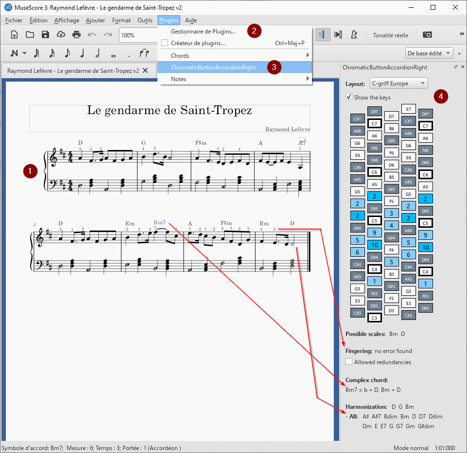

# Tools for your chromatic button accordion in MuseScore

I am learning the chromatic button accordion and use MuseScore a lot to prepare my music. I needed an assistant to:

- see at glance which buttons the right hand should press for a track,
- detect the suitable key signature,
- check the fingering in the annotations,
- expand the chords to make them playable with the Stradella bass system,
- find some suitable chords within a defined scale.

For what it's worth, here is the plugin for doing that! Enjoy.

## Setup

By respecting the target version of your MuseScore, download the QML file into one of these folders:

- Windows:
	- `C:\FolderOf\MuseScore\Plugins\`
	- `%USERPROFILE%\Documents\MuseScore3\Plugins\`
	- `%USERPROFILE%\Documents\MuseScore4\Plugins\`
- Linux:
	- `~/Documents/MuseScore4/Plugins/`
	- `~/.local/share/data/MuseScore/Plugins/`

1. Run MuseScore
2. Activate the plugin `ChromaticButtonAccordionRight` in the manager (Mu3) or from the home screen (Mu4)
3. Call the plugin from the menu
4. Look at the appearing accordion

The accordion refreshes itself every 3 seconds.

## Known limitations

### General

- The score in the screenshot is the typical supported format

### Usage of the buttons

The feature counts the notes and highlights them with 6 possible layouts.

- To rotate the accordion by default, edit the plugin with a text editor
- First track only
- 8va/8vb not supported
- Grace notes not supported

### Possible scales

The feature finds the scales that contain as much notes as possible. It helps you to define the key signature and the associated chords.

- Multiple scales per song not supported
- The more various notes, the more accurate the proposed scales
- Manual choice of the final minor or major scale with the help of the virtual accordion

### Fingering

The feature verifies if each note is assigned to a finger. It is very useful at the stage of learning a new song.

- First track only
- First voice only
- Multiple time signatures not supported
- Chords not supported
- First finger only not supported
- Grace notes not supported
- No physical validation of the hand movement
- No musical validation of the order of the fingering

### Expanded chords

The feature is dedicated to the Stradella bass system to split a complex chord into simple chords.

Main assumption : C7 equals `E + G + Bb` and `C♯dim7`.

### Harmonization

The feature finds playable and simple chords to create your bass line. The chords that belong to the current scale are displayed on the first line.

- Multiple key signatures not supported
- Complex chords not suggested
- No musical validation of the chord progression
